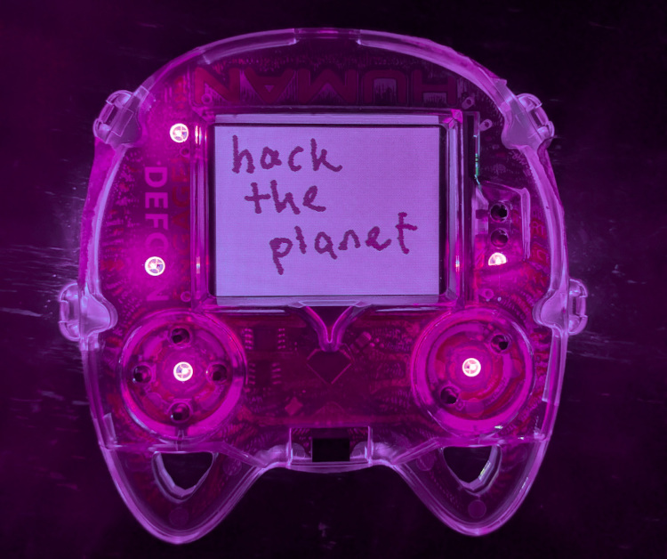
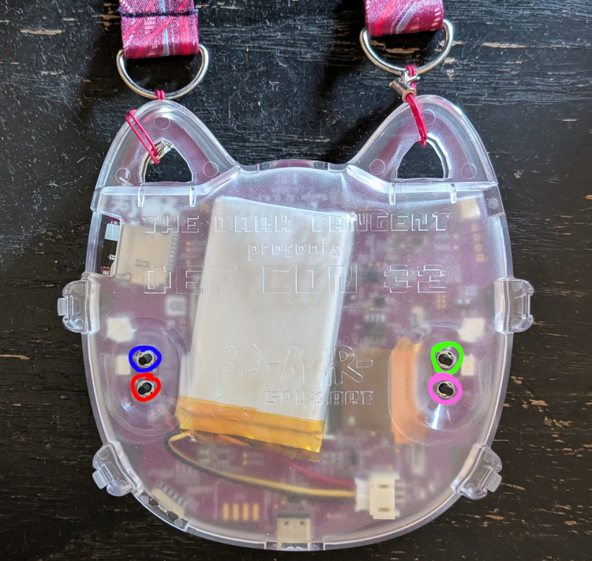

# DEF CON 32 Badge MicroPython Firmware
A launcher and some programs for the DC32 badge. Highlights:

- Universal IR remote
- Drawing app with IR messaging
- Blinky Lights

It's all written in Micropython and the drivers use the hardware to go fast, so no need to compile extra C modules unless you add something that requires it. 

# Installing
If you have added a PSRAM chip to your badge, there are uf2s to actually take advantage of it (as much as micro python can, anyway). If you don't have that and you're interested, get yourself a APS6404L-3SQR-SN or similar and stick it in the blank spot next to the D-Pad (hardware schematic is on the DEF CON media server [here](https://media.defcon.org/DEF%20CON%2032/DEF%20CON%2032%20badge/)). 

If you have the PSRAM chip on your badge, use the "-psram" uf2 files.

Note: Flashing new firmware will erase anything in the badge's flash memory (except sometimes if it's already micropython files). This includes the game's save file if it's not stored to the SD card. To reinstall the default firmware, you will need to flash another uf2. There are copies of the original badge firmware and the original contents of the SD card on the DEF CON media server [here](https://media.defcon.org/DEF%20CON%2032/DEF%20CON%2032%20badge/).

## Option 1: Easiest

1. Download `firmware-frozen-modules.uf2` from the `compiled firmware` folder. 
2. Hold the badge ears up with the screen facing away from you.
3. Plug the badge into your computer (or phone, I've tested on Android, not sure about iOS). 
4. Hold bottom left button (red)
5. Tap top left button (blue), then you can release the bottom left button.
6. A drive called RP2350 should appear. 
7. Drag `firmware-frozen-modules.uf2` into the drive. 
8. The badge should reboot automatically with the new firmware. 

## Option 2: For development
The previous option does not allow you to make changes easily, since the python files are compiled to bytecode and frozen into the firmware. This is more efficient for RAM and storage, but not ideal if you want to hack on it.

To get the files into the flash, do the same steps as above, but use the file `firmware-empty.uf2`. This is just plain old micropython plus the SD card library. I'm pretty sure you can also use fully vanilla MicroPython and the actual SDCard file from [[here](https://github.com/micropython/micropython-lib/blob/f95568da431c6506354adb93343206c04a94dc11/micropython/drivers/storage/sdcard/sdcard.py)].

Then using mpremote, Thonny, VSCode with MicroPico, or something else, copy everything listed in manifest.py over to the badge. Restart it and main.py should run (or you may have to run it manually if the program you're using allows that). 

(I found it helpful to rename `main.py` when actively working on this so it wouldn't automatically run. That way, resetting the badge gave me a chance to recover if a change was making it crash or freeze.)

See additional information about building your own uf2 in [Contributing.md](Contributing.md)

# IR Remote
Use your badge as a TV remote! Currently it can record and replay raw signals, and send NEC and NECext. This should cover the majority of recordings in the [IrDB](https://github.com/Lucaslhm/Flipper-IRDB), but not all. 

It tries to save and read files to/from an `ir_recordings` folder on the SD card, but it will use flash memory if an SD card is not detected.

If you would like to add support for another protocol, please do! The file parsing is a little messy but I left some comments in `read_ir_file.py` about where to add new protocols. The actual decoding logic for NEC is in `lib.py` if you want an example of that as well.

# Paint app
Draw on the screen and send your drawing to another person through the retro-futuristic magic of Infrared! 

(note: this app uses IrDA SIR and is not compatible with the Flipper or other universal remotes)

## Controls

Hold Left: Wait to receive a drawing

Right: Send your drawing to someone else

B: Undo

A: Redo

Start: Clear screen and randomize colors

Select: Menu/Home 

# Adding other programs

# WARNING
Any program you put on the badge can execute arbitrary MicroPython code with no guardrails whatsoever. Someone could do naughty things like make your badge emulate a keyboard and mouse and generate input to your computer over USB. So, please be careful. It's no more or less safe than downloading a different random uf2 and flashing your badge, but if I use the word "app" someone might get the idea there's any sandboxing whatsoever. There is not and you have been warned!

I've also used less-than-officially-sanctioned-for-rp2350 SD card compilation options, so don't trust this to keep your data uncorrupted. If there's anything important on your SD card, back it up! 

## Adding a program
Place a python file into the flash memory, and add its module name to the list in `programs.json`. It will be put in the menu and when the badge starts up. 

The file should have a .py extension and be a valid Python module name: all lower case, can contain underscores, can contain numbers but does not start with a number. This is because it's just being loaded as a Python module. It may be easiest to copy the example in your_module_here.py and edit it.

# Plans and ideas for the future 
(A very non-exhaustive list, there is a lot that could be done!)

- [ ] Use the accelerometer to change the screen rotation
- [ ] Use the RTC to keep track of the actual date and time
- [ ] An IrDA messaging app with text instead of drawings
- [ ] Something to use the speaker, maybe a piano app? 
- [ ] Use the SAO port for something
- [ ] Lots more Neopixel animations
- [ ] Custom themes--I made a color chooser widget, it's just not used for anything yet
- [ ] Display images from a file on the screen (I think if you convert them to bitmaps using RGB565 colors, it should be easy to dump them into the framebuf, I just haven't tried yet)
- [ ] Decode more IR formats
- [ ] Make it possible to delete and rename recordings/files/directories from the IR remote app
- [ ] Add a way to display text in other sizes and fonts (this is a solved problem in the russ hughes st7789 driver and micropython nano gui, but I haven't investigated how they did it yet. Nano gui is probably most similar because it uses framebufs)
- [ ] literally any decently usable tools for creating layouts and UIs
- [ ] Make a nice interface for apps to opt into manually triggering screen redraws so they can have smoother animations

# Thank you
Thanks to Entropic Engineering for making a very cool and fun piece of hardware. Additional credit for various helpful things, examples, tutorials, and prior art:

- https://github.com/russhughes/st7789py_mpy
- https://github.com/russhughes/st7789_mpy
- https://github.com/peterhinch/micropython-nano-gui
- https://github.com/Phaeilo/dc32_badge_micropython
- https://github.com/p0ns/micropython-dc32
- https://dmitry.gr/?r=06.%20Thoughts&proj=09.ComplexPioMachines
- https://github.com/Wind-stormger/micropython-uasycio-buzzer
- Dmitry Grinberg's original badge firmware, which is in Discord somewhere
