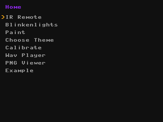
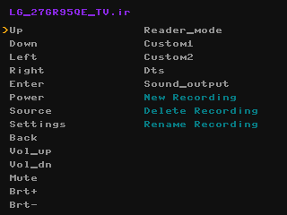
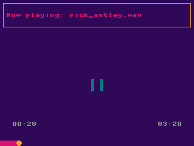

# DEF CON 32 Badge MicroPython Firmware


A launcher and some programs for the DC32 badge. Highlights:

- Universal IR remote
- Wav file player (8 bit unsigned only, see below for an ffmpeg command to convert to this)
- PNG viewer (8 bit per color RGB and attempts 8 bit per color RGBA but ignores the alpha part)
- Drawing app with IR messaging
- Blinky Lights

It's all written in Micropython and the drivers use the peripherals to go fast, so no need to compile extra C modules unless you add something that requires it. 

[How to install](#installing)

# IR Remote



Use your badge as a TV remote! Currently it can record and replay raw signals, and send NEC and NECext. This should cover the majority of recordings in the [IrDB](https://github.com/Lucaslhm/Flipper-IRDB), but not all. 

It tries to save and read files to/from an `ir_recordings` folder on the SD card, but it will use flash memory if an SD card is not detected.

If you would like to add support for another protocol, please do! The file parsing is a little messy but I left some comments in `read_ir_file.py` about where to add new protocols. The actual decoding logic for NEC is in `lib.py` if you want an example of that as well.

# WAV audio player


Browse and play .wav files from the "music" directory on your SD card. Use the up and down buttons to control the volume.

It can play mono 8 bit unsigned PCM wav files. 

Supported sample rates:

- 8000
- 11,025
- 16,000
- 22,050

To convert audio files to a usable format, you can use ffmpeg:

```
ffmpeg -i your_source_file.mp3 -ar 22050 -ac 1 -acodec pcm_u8 -sample_fmt u8 your_output_file.wav
```

(ar = audio sampling rate, ac= audio channels)

You can also export a WAV file from audacity, just make sure "channels" is mono, sample rate is one of the listed sample rates, and "encoding" is Unsigned 8-bit PCM. 

(Note: I tried making the badge play 16 bit signed and 44100 sample rate WAVs and it kiiiind of worked, but sounded worse than these options because it could barely keep up, and it uses a lot of space for no particular benefit.)


# PNG viewer
Browse and view png images from the "images" directory on your SD card. Rotate the image once it has finished drawing by pressing the A button.

If the image is too large to fit on the screen, it gets scaled down by the smallest integer that makes it fit entirely on the screen (eg 1/1, 1/2, 1/3, 1/4...). The entire file still needs to be read and decoded, so large images will draw slowly. For best performance scale or crop images to 320 x 240 or smaller.

It can display RGB and RGBA (ignores the alpha but does display the image) with 8 bit color depth. This should cover most common PNGs. 

# Paint app


Draw on the screen and send your drawing to another person through the retro-futuristic magic of Infrared! 

(note: this app uses IrDA SIR and is not compatible with the Flipper or other universal remotes)

## Controls

Hold Left: Wait to receive a drawing

Right: Send your drawing to someone else

B: Undo

A: Redo

Start: Clear screen and randomize colors

Select: Menu/Home 

# LED animations
There are some built in animations, and more can be added in an extra_animations.py file. There is an example in this repo, and a file will also be generated if one does not exist when the Blinkenlights program is run. See Contributing.md for an explanation of how the animations work.


# Installing
If you have added a PSRAM chip to your badge, there are uf2s to actually take advantage of it (as much as micro python can, anyway). If you don't have that and you're interested, get yourself a APS6404L-3SQR-SN or similar and stick it in the blank spot next to the D-Pad (hardware schematic is on the DEF CON media server [here](https://media.defcon.org/DEF%20CON%2032/DEF%20CON%2032%20badge/)). 

If you have the PSRAM chip on your badge, use the "-psram" uf2 files.

Note: Flashing new firmware will erase anything in the badge's flash memory (most of the time, if it's already holding micro python files it may not erase them). This includes the game's save file if it's not stored to the SD card. To reinstall the default firmware, you will need to flash another uf2. There are copies of the original badge firmware and the original contents of the SD card on the DEF CON media server [here](https://media.defcon.org/DEF%20CON%2032/DEF%20CON%2032%20badge/). The process is exactly the same as the one described below, but using a different .uf2 file.

## Method 1: Easiest


1. Download [firmware-frozen-modules.uf2](compiled%20firmware/firmware-frozen-modules.uf2) (in the `compiled firmware` folder)
2. Hold the badge ears up with the screen facing away from you.
3. Plug the badge into your computer (or phone, I've tested on Android, not sure about iOS). 
4. Hold bottom left button (red, Bootsel)
5. Tap top left button (blue, Reset)
6. A drive called RP2350 should appear. 
7. Drag `firmware-frozen-modules.uf2` into the drive. 
8. The badge should reboot automatically with the new firmware. 

## Method 2: For development
Option 1 does not allow you to make changes easily, since the python files are compiled to bytecode and frozen into the firmware. This is more efficient for RAM and storage, but not ideal if you want to hack on it.

To get the files into the flash, do the same steps as above, but use the file `firmware-empty.uf2`. This is just plain old micropython plus the SD card library. I'm pretty sure you can also use fully vanilla MicroPython and the actual SDCard file from [[here](https://github.com/micropython/micropython-lib/blob/f95568da431c6506354adb93343206c04a94dc11/micropython/drivers/storage/sdcard/sdcard.py)].

Then using mpremote, Thonny, VSCode with MicroPico, or something else, copy everything listed in manifest.py over to the badge. Restart it and main.py should run (or you may have to run it manually if the program you're using pauses the execution). 

(I found it helpful to rename `main.py` when actively working on this so it wouldn't automatically run. That way, resetting the badge gave me a chance to recover if a change was making it crash or freeze.)

See additional information about building your own uf2 in [Contributing.md](Contributing.md)

# Adding other programs

## WARNING
Any program you put on the badge can execute arbitrary MicroPython code with no guardrails whatsoever. Someone could do naughty things like make your badge emulate a keyboard and mouse and generate input to your computer over USB. So, please be careful. It's no more or less safe than downloading a different random uf2 and flashing your badge, but if I use the word "app" someone might get the idea there's any sandboxing whatsoever. There is not and you have been warned!

I've also used the less-than-officially-sanctioned-for-rp2350 SD card library, so don't trust this to keep your data uncorrupted. If there's anything important on your SD card, back it up! 

## Adding a program
Place a python file into the flash memory, and add an entry to the list in `programs.json`. It will be put in the menu when the badge starts up. Each item in the "programs" list in `programs.json` is a JSON object:

```json
{
    "name": "Display Name",
    "modname": "path.to.module_name"
}
```

The file with the program needs a .py extension and must be a valid Python module name: all lower case, can contain underscores, can contain numbers but does not start with a number. This is because it's just being loaded as a Python module. 

It may be easiest to copy the example file `your_module_here.py` and edit it. You can put it inside a directory, just make the module name in the JSON object the full path separated by dots (like you would do for a Python import statement). There is an example in programs.json.

# Plans and ideas for the future 
(A very non-exhaustive list, there is a lot that could be done!)

- [ ] Use the accelerometer to change the screen rotation
- [ ] Use the RTC to keep track of the actual date and time
- [ ] An IrDA messaging app with text instead of drawings
- [X] Something to use the speaker
- [ ] A piano app
- [ ] Use the SAO port for something
- [ ] Lots more Neopixel animations
- [ ] Custom themes--I made a color chooser widget, it's just not used for anything yet
- [X] Display images from a file on the screen
- [ ] Decode more IR formats
- [X] Make it possible to delete and rename recordings/files/directories from the IR remote app
- [ ] Add a way to display text in other sizes and fonts (this is a solved problem in the russ hughes st7789 driver and micropython nano gui, but I haven't investigated how they did it yet. Nano gui is probably most similar because it uses framebufs)
- [ ] literally any decently usable framework for creating layouts and UIs, it's a bit hacked together at the moment
- [X] Make a nice interface for apps to opt into manually triggering screen redraws so they can have smoother animations

# Thank you
Thanks to Entropic Engineering for making a very cool and fun piece of hardware. Additional credit for various helpful things, examples, tutorials, and prior art:

- https://github.com/russhughes/st7789py_mpy
- https://github.com/russhughes/st7789_mpy
- https://github.com/peterhinch/micropython-nano-gui
- https://github.com/Phaeilo/dc32_badge_micropython
- https://github.com/p0ns/micropython-dc32
- https://dmitry.gr/?r=06.%20Thoughts&proj=09.ComplexPioMachines
- https://github.com/Wind-stormger/micropython-uasycio-buzzer
- Dmitry Grinberg's original badge firmware, which is in Discord somewhere
- https://antirez.com/news/143 for explaining how to play actual sounds beyond square waves!
- https://pyokagan.name/blog/2019-10-14-png/ for a very helpful explanation of and example code for decoding PNGs in Python